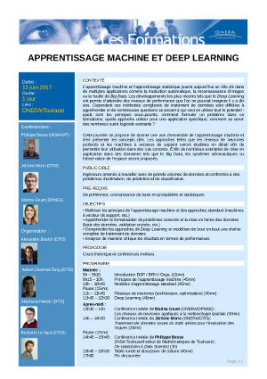

### Deep Learning classes

These full-day seminars are intended to give understanding of the key-concepts of machine learning and deep learning to an audience of engineers and research scientists. They are organized as a half-day tutorial to give theoretical basics and a half-day workshop with invited talks about more applied topics.

#### 2017/01/24, Onera Palaiseau center

 

Slides for Deep Learning classes:

* **Principles of Machine Learning** by *Bertrand Le Saux* ([Slides](education/DL2017_01_BLS.pdf) in French)

* **Classification and Support-Vector Machines** by *Stéphane Herbin* ([Slides](education/DL2017_02_SH.pdf) in French)

* **Neural Networks** by *Adrien Chan-Hon-Tong* ([Slides](education/DL2017_03_ACHT.pdf) in French)

* **Deep Learning** by *Alexandre Boulch* ([Slides](education/DL2017_04_AB.pdf) in French)

Invited Talks:

* *Sidonie Lefèvre* (ONERA/DOTA) **Machine learning methods for analysis of aircraft infra-red features**

* *Thibaut Castaings* (ONERA/DTIS) **achine learning methods for space observation**

* [*Olivier Sigaud*](http://www.isir.upmc.fr/index.php?op=view_profil&id=28&old=N&lang=en) (UPMC/[ISIR](http://www.isir.upmc.fr/index.php?op=view_page&id=2&menuid=1&old=N&lang=en)) **From Machine Learning to Deep Learning with a focus on regression
and reinforcement learning**

#### 2017/06/13, Onera Toulouse center

 

Slides for Deep Learning classes:

* **Introduction and Feature extraction** by *Bertrand Le Saux* ([Slides](education/DL2017_01_intro_data_extraction.pdf) in French)

* **Classification and Support-Vector Machines** by *Alexandre Boulch* ([Slides](education/DL2017_02_AB_classification_supervisee.pdf) in French)

* **Neural Networks** by *Bertrand Le Saux* ([Slides](education/DL2017_03_neural_nets.pdf) and [Slides](education/DL2017_04_BLS_images.pdf) in French)

* **Deep Learning** by *Alexandre Boulch* ([Slides](education/DL2017_05_AB_deep.pdf) in French)

Invited Talks:

* *Marina Gruet* (ONERA/DPhIEE) **Neural networks for space weather prediction**

* [*Jérôme Morio*](http://www.onera.fr/en/staff/jerome-morio) (ONERA/DTIS) **Aerial traffic data analysis for risk evaluation**

* [*Philippe Besse*](https://www.math.univ-toulouse.fr/~besse/) (INSA Toulouse/[IMT](https://www.math.univ-toulouse.fr/?lang=en)) **From statistician to data scientist**
