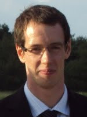
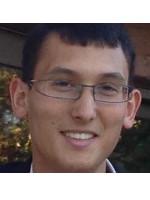
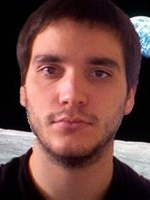
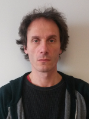
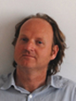

### DeLTA team

DeLTA's main objective is to export and broadcast machine learning techniques to various aerospace applicative fields.
The team regroups researchers from different fields from image processing and machine learning to mechanics.

### [DTIM - Modeling and Information Processing](http://www.onera.fr/en/dtim)

Dr. [Alexandre Boulch](https://sites.google.com/view/boulch)
received an engineering degree from the Ecole Polytechnique, a M.Sc in Computer Vision and Machine Learning at ENS Cachan and a PhD from the Eastern Paris University (UPE) with a thesis focusing on geometric and semantic reconstruction for buildings. His research fields are computational geometry and machine learning for remote sensing data, including Lidar and satellite imagery.

Dr. [Adrien Chan-Hon-Tong](https://www.researchgate.net/profile/Adrien_Chan-Hon-Tong)
received an M.Sc from the Ecole Polytechnique and a PhD from CEA/UPMC on daily activity semantic segmentation. His research field at the ONERA is computer vision and machine learning, and especially, small (10 to 60 px) object detection in aerial images.

Dr. [Stéphane Herbin](http://www.onera.fr/fr/staff/stephane-herbin)

Dr. [Bertrand Le Saux](http://www.onera.fr/en/staff/bertrand-le-saux)

Dr. [Aurélien Plyer](https://www.researchgate.net/profile/Aurelien_Plyer) graduated from Université Pierre et Marie Curie (Paris 6) in 2008 and received his PhD degree in Image Processing from the Université de Paris  13, in 2013. He is now working in the Information Processing and Modeling Department at ONERA, the French Aerospace Lab. His research deals with high efficiency parallel methods for low-level video processing and 3D environment perception, with application to robotics and experimental physics.

Dr. [Guy Le Besnerais](https://scholar.google.fr/citations?user=r8V306wAAAAJ&hl=fr) graduated from ENSTA in 1989 and obtained his PhD degree from Université Paris Sud in 1993. Since 1994, he has been working in the Information Processing and Modeling Department at ONERA, the French Aerospace Lab. He obtained the degree of Habilitation à Diriger les Recherches (HDR) in 2008 and is affiliated to Paris-Saclay University. Since October 2016, he is a Research Director at ONERA. His research activities include methods for

Dr. [Frédéric Champagnat](https://www.researchgate.net/profile/Frederic_Champagnat) graduated from ENSTA in 1989 and obtained his PhD degree from Université Paris Sud in 1993. Since 1999 he has been working in the Information Processing and Modeling Department at ONERA, the French Aerospace Lab. Since 2010, he has been a senior scientist and achieved the degree of Habilitation à Diriger les Recherches (HDR) in 2011. He is affiliated to Paris-Saclay University and is a member of the board of the first Comité de Pôle of the STIC doctorate school. His research activities include stochastic modeling of signals and images, methods for solving inverse problems, image deblurring and super-resolution and performance modeling for imaging measurement systems. His work is applied in video processing, satellite and airborne imaging, metrology by imaging in fluid mechanics, and the co-design of hybrid sensor+processing systems.

---

### [DEMR - Electromagnetism and Radar](http://www.onera.fr/en/demr)

* Reynald Doktor
* Patrick Millot
* Gilles Vieillard
* Christelle Morisseau

---

### [DOTA - Theoretical and Applied Optics](http://www.onera.fr/en/dota)

* Véronique Achard

---

### [DAAP - Applied Aerodynamics](http://www.onera.fr/en/daap)

* Jean-Luc Hantrais-Gervois

---

### [DAFE - Fundamental and Experimental Aerodynamics](http://www.onera.fr/en/dafe)

* Benjamin Leclaire
* Samir Beneddine
* Olivier Marquet
* Denis Sipp

---

### [DMSC - Composite Systems and Materials](http://www.onera.fr/en/dmsc)

* François-Henri Leroy
* Jean-Michel Roche
