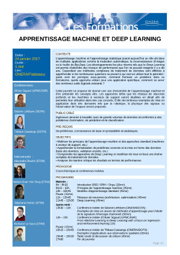

### Deep Learning classes

On 2017/01/24, A day of professionnal continuing education was organized at Onera Palaiseau center. 

<> 

 

Slides for Deep Learning classes :

* **Principles of Machine Learning** by *Bertrand Le Saux*

[Slides](education/DL2017_01_BLS.pdf) in French

* **Classification and Support-Vector Machines** by *Stéphane Herbin*

[Slides](education/DL2017_02_SH.pdf) in French

* **Neural Networks** by *Adrien Chan-Hon-Tong*

[Slides](education/DL2017_03_ACHT.pdf) in French

* **Deep Learning** by *Alexandre Boulch*

[Slides](education/DL2017_04_AB.pdf) in French
