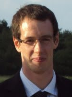
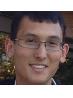
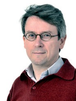
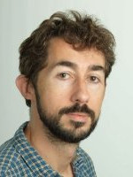

### DeLTA team

DeLTA's main objective is to export and broadcast machine learning techniques to various aerospace applicative fields.
The team regroups researchers from different fields from image processing and machine learning to mechanics.

### DTIM - Modeling and Information Processing

|| Dr. [Alexandre Boulch](https://sites.google.com/view/boulch) received an engineering degree from the Ecole Polytechnique, a M.Sc in Computer Vision and Machine Learning at ENS Cachan and a PhD from the Eastern Paris University (UPE) with a thesis focusing on geometric and semantic reconstruction for buildings. His research fields are computational geometry and machine learning for remote sensing data, including Lidar and satellite imagery.|
|| Dr. [Adrien Chan-Hon-Tong](https://www.researchgate.net/profile/Adrien_Chan-Hon-Tong)|
|| Dr. [Stéphane Herbin](http://www.onera.fr/fr/staff/stephane-herbin)|
|| Dr. [Bertrand Le Saux](http://www.onera.fr/en/staff/bertrand-le-saux)|

### DEMR - Electromagnetism and Radar

### DOTA - Theoretical and Applied Optics

### DAAP - Applied Aerodynamics

### DAFE - Fundamental and Experimental Aerodynamics

### DMSC - Composite Systems and Materials
