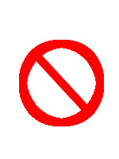

### DeLTA team

DeLTA's main objective is to export and broadcast machine learning techniques to various aerospace applicative fields.
The team regroups researchers from different fields from image processing and machine learning to mechanics.

###DTIM - Modeling and Information Processing

|| [Alexandre Boulch](https://sites.google.com/view/boulch)|
|| [Adrien Chan-Hon-Tong](https://www.researchgate.net/profile/Adrien_Chan-Hon-Tong)|
|| [Stéphane Herbin](https://www.researchgate.net/profile/Stephane_Herbin)|
|| [Bertrand Le Saux](http://www.onera.fr/en/staff/bertrand-le-saux)|

### DEMR - Electromagnetism and Radar

### DOTA - Theoretical and Applied Optics

### DAAP - Applied Aerodynamics

### DAFE - Fundamental and Experimental Aerodynamics

### DMSC - Composite Systems and Materials
